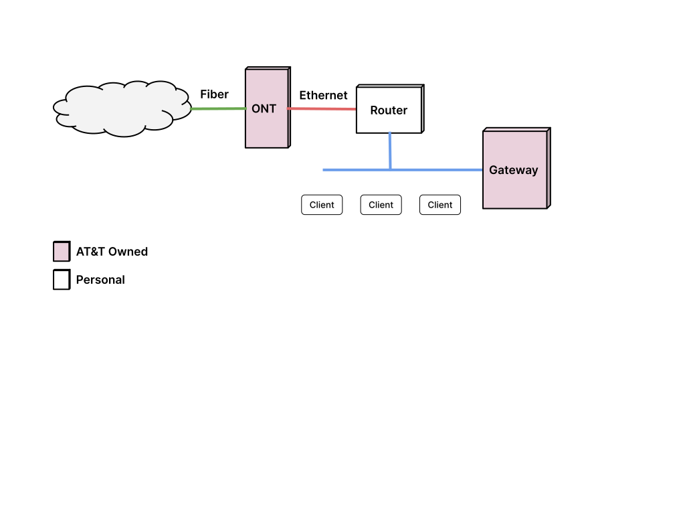

## 개요

저는 홈 인터넷을 [AT&T Fiber](https://att.com/fiber) 플랜을 사용하고 있습니다.
운이 좋게도, 가정집인데도 광케이블이 집 앞까지 들어와서 4년째 사용중입니다.
처음엔 300Mbps 플랜을 쓰다가, 코비드 기간동안 재택근무를 하게 되면서 1Gbps로
업그레이드 해서 사용하고 있습니다.

AT&T 광케이블을 사용하면 하얀색 박스 (ONT)와 검은색 AT&T
게이트웨이(BGW210-700)가 제공됩니다. 요즘 신청하면 하얀색 덩치 큰
게이트웨이(BGW320-500/505) 하나로 끝나는 것 같긴 한데, 제가 신청했을 땐 두
기기를 연결해야만 했죠.


흰색 ONT 박스는 벽에 설치되어 광케이블 신호를 이더넷 신호로 변환시켜주는 역할을
합니다. 검은색 게이트웨이는 이더넷 신호를 받아서 인증을 하고, 라우터 역할을
하죠. Wifi 네트웍도 제공합니다.

그러나 저는 이 기능이 마음에 들지 않아서 게이트웨이는 IP Passthrough 모드로 두고
와이파이는 끈 후 내부에 라우터 (혹은 메시 네트웍 라우터)를 따로 두고
사용했습니다. 게이트웨이의 와이파이 성능이 좋지도 않을 뿐더러, 메시 네트웍도
되지 않고, Firewall 기능이나 필터링 기능이 부족해서 거추장스러웠죠.

게이트웨이가 아무 역할을 하지 않다보니 이걸 켜 두는게 보기 그렇더군요. 부피도
상당한 것도 있지만, 파워어댑터를 하나를 더 쓰고 있는 게 싫었습니다. ONT에서
이더넷 케이블이 직접 나오니 그걸 라우터에 연결 해 보았지만, IP를 받아오질 못하고
인터넷이 되질 않더군요. 검색을 좀 해 보니 802.1X 인증을 통과해야지만 인터넷을
사용할 수 있다네요. 즉, AT&T에서 제공한 게이트웨이를 쓰지 않으면 공용IP를 받아올
수 없습니다. 게이트웨이를 떼버리고 싶어도 이 인증때문에 계속 쓸 수 밖에 없었죠.

## 게이트웨이 없애기

몇년을 그렇게 사용해 왔습니다. 그러다 최근에 우연히 Gateway를 인터넷 라인에서 빼
버리는 방법을 알게되었습니다.

### VLAN 0 Forwarding



한가지 방법은, 고급 기능을 가지고 있는 라우터는 특정 패킷을 내부 디바이스로
포워딩할 수 있습니다. 위에서 언급한 802.1X 인증은 VLAN ID 0로 들어오는 데, 이걸
그림과 같이 게이트웨이로 포워딩 하면, 게이트웨이는 인증만 하고 IP를 받아오거나
인터넷 트래픽을 라우팅하는 것은 개인 라우터에서 가능합니다.

그러나 이 방법은 파워어댑터를 하나를 줄이지 못합니다. 그냥 게이트웨이의 제약을
넘어서는 정도죠. pfSense 소프트웨어를 쓰는 라우터는 이 기능이 내장되어있습니다.
AT&T 게이트웨이를 내부 이더넷 포트 하나에 연결하고, 다른 내부 이더넷 포트에 일반
스위치나 AP를 연결하면 인증용으로만 게이트웨이를 사용합니다.

### 게이트웨이 인증

조금 더 발전된 방법은 게이트웨이가 하는 인증을 라우터가 대신 하는 방법입니다.
네트웍 지식이 없는 사람은 따라하기 쉽진 않지만, 구성하고 나면 게이트웨이를
완전히 없앨 수 있습니다.


802.1X 인증을 하기 위해선 인증서가 필요합니다. 이 인증서는 AT&T 게이트웨이 안에
저장되어 있죠. 이 인증서 데이터는 보통의 방법으로는 접근할 수 없습니다.
게이트웨이를 루팅해서 관리자 권한을 얻은 후에 추출해 내거나, 아니면 기기를
분해해서 인증서가 저장 된 플래시 장치를 디솔더링 한 후 얻어내야 합니다.

전 루팅하는 방법을 시도했습니다. 인터넷에 몇가지 방법이 나와있는데 대부분
펌웨어를 1.19.2로 다운그레이드 한 후 그 버전에 있는 취약점을 이용해서 루팅하는
방법입니다.

아쉽게도 제 게이트웨이는 최신 버전 (4.23.4)이라 다운그레이드가 되질 않더군요.
그래서 포기하고 기기를 다른 것으로 바꾸었는 데, 나중에 성공 후에 보니
4.23.4에서도 다운그레이드가 가능한 펌웨어 이미지가 있었습니다. (3.18.2_EN)

### 인증파일 구입

만일 루팅이나 디솔더링이 어렵다면 이베이에서 50~80 달러 정도에 인증서를
구입하셔도 됩니다. 인증서는 게이트웨이마다 고유한 데이터라서 중복이 되면
안되는데, 판매하는 업자는 오래된 BGW210-700 게이트웨이를 구해서 인증서를 추출한
후 파기하더군요.

### 인증서를 라우터에서 사용하기

이렇게 받은 인증서 데이터를 [mfg_dat_decode][]를 이용해서 `.pem` 파일로 변환해
주면 됩니다. 이 인증파일로 802.1X 인증을 주기적으로 해 줘야 인터넷 연결을 유지할
수 있습니다. 라우터중에 리눅스나 FreeBSD 운영체제가 실행되고, SSH 연결을
지원하는 라우터들이 있습니다. 그런 라우터 안에서 `wpa_supplicant` 프로그램을
실행해서 인증을 할 수 있습니다. 가능한 라우터는 [Unifi Dream Machine][] 시리즈나
[pfSense][], [OPNsense][], [Firewalla][] 같은 제품입니다.

[mfg_dat_decode]: https://github.com/iwleonards/extract-mfg

[Unifi Dream Machine]: https://store.ui.com/us/en/collections/unifi-dream-machine
[pfSense]: https://www.pfsense.org/
[OPNsense]: https://opnsense.org/
[Firewalla]: https://firewalla.com/products/firewalla-gold

[mfg_dat_decode][] 를 실행하면 `wpa_supplicant.conf` 파일이 만들어지는 데, 이게
`wpa_supplicant`를 실행하는 설정파일입니다. 각 라우터에 맞게 조금 수정을 한 후
라우터에서 실행을 하면 인증이 되고 곧바로 IP를 받아 오게 됩니다. 게이트웨이 MAC
주소와 라우터의 MAC 주소가 다르면 시간이 최대 20분 소요되니 미리 라우터 인터넷
포트의 MAC 주소를 게이트웨이 MAC 주소로 변경하는 것을 추천합니다.

이 단계까지만 진행해도 이미 충분히 쓸만합니다. 게이트웨이가 사라져서 연결이
깔끔해졌고 라우터의 성능을 십분 발휘할 수 있습니다.

여기에 더 나아가서 AT&T ONT 까지 없앨 수도 있습니다.

## ONT와 게이트웨이 없애기

최종 버전으로는 ONT와 게이트웨이 모두 없애는 방법입니다. AT&T 의 ONT 박스를
없애고 광케이블용 소켓인 SFP+ 에 바로 연결하는 방법입니다. 이 방법은 라우터가
SFP+ 포트를 가지고 있는 경우 (Unifi Dream Machine 등)에는 장점이 있습니다.
라우터가 이더넷 포트 (RJ45)만 있을 경우엔 이 SFP+를 이더넷 신호로 변환해 주는
Media Converter 장치가 필요해서 큰 이득은 없습니다.


Fiber 플랜이나 기타 상황에 따라 ONT 기기에서 인증이 이뤄질 수도 있고, 아니면
AT&T의 OLT (ONT가 연결되는 기기)에서 802.1X 인증이 될 수도 있습니다. ONT 단에서
게이트웨이와 인증이 진행되는 경우라면, ONT를 바꿈으로써 더이상 인증이 필요 없을
수도 있습니다.

2Gbps, 5Gbps 플랜은 광케이블 통신에 XGS-PON 프로토콜을 사용합니다. 이 경우에는
아래의 모듈(EN-XGSFPP-OMAC-V2)을 사용할 경우 인증이 필요하지 않습니다. 위의
인증서를 추출하거나 구입할 필요가 없는거죠.

1Gbps 이하의 플랜의 경우에는 복불복입니다. 1Gbps 이하의 플랜은 GPON 프로토콜을
사용하는데 대부분은 인증이 필요합니다. 인증이 AT&T 단에서 이뤄지기 때문에,
라우터에서 인증서를 이용해 `wpa_supplicant`를 실행해야 합니다.


DFP-34X-2C2 같은 SFP+ 소켓에 삽입하는 모듈이 GPON 프로토콜을 SFP로 바꿔줍니다.
이 디바이스에 telnet이나 SSH로 접속해서 내부 정보를 AT&T의 ONT 모듈과 동일하게
바꿔주면 AT&T에서는 자기 장비로 인식하고 인터넷을 접속할 수 있게 해 줍니다. 이
과정을 OMCI Provision이라고 합니다. 자세한 정보는 아래 References 항목에 GPON
링크를 따라가서 참조하시면 됩니다.

2Gbps, 5Gbps는 XGS-PON 프로토콜을 사용한다고 언급했는데, 그 XGS-PON을 지원하는
모듈은 EN-XGSFPP-OMAC-V2 같은 모듈이 있습니다. 방법은 GPON 모듈과 동일합니다.

Serial Number, HW Version, SW Version을 잘 입력했다면, OMCI provision이 잘 되고
인터넷을 사용할 수 있습니다. 위에서 언급했듯이, 라우터가 RJ45 이더넷 포트만
있다면, SFP+를 이더넷으로 변환해주는 장치가 필요합니다.

### Firewalla

전 이 부분에서 많이 헤맸습니다. AT&T ONT와 제 라우터 (Firewalla Gold)와 문제없이
잘 동작했는데, GPON ONU와 연결하면 인증이 되질 않고 Timeout만 되더군요. 이런
저런 방법을 써보고 했지만 며칠동안 성공하질 못했습니다.

VLAN ID는 제대로 받아왔었는데, VLAN ID를 받아왔다는 것은 AT&T에서 제 GPON ONU를
잘 인식해서 할당해 줬다는 의미더군요. 그래서 문제는 802.1X 인증을 하는
`wpa_supplicant` 프로그램의 문제였습니다.

기존 AT&T ONT를 이용해서 인증을 하면 802.1X 인증의 VLAN ID를 신경 쓸 필요가
없다고 하네요. ONT 기기가 알아서 처리해 줍니다. 그러나 GPON ONU를 사용하게 되면
wpa_supplicant도 VLAN ID를 잘 처리해야 합니다.

해결 방법이 두가지가 있습니다.

1. 인증 프로그램을 패치해서 VLAN 0 트래픽도 잘 처리하게 만드는 것
1. VLAN 0 가상인터페이스를 만들어서 VLAN 0 필드를 처리 후 인증 프로그램에 넘겨주는 것

첫번째 방법은 재컴파일을 해야 합니다. 대신에 가상 인터페이스를 추가로 만들
필요가 없으니 시스템 구성이 간단해 집니다. 두번째 방법은 가상 인터페이스를 하나
더 추가해서 쓰지만, 프로그램을 패치할 필요가 없습니다. 다만 라우터마다 구성
방법이 다르고, 재부팅 하면 다시 설정해야 하는 경우도 있습니다.

저는 일단 임시로 두번째 방법으로 설정했습니다. 먼저 가상 인터넷을 하나 추가합니다.

```shell
$ sudo ip link add link eth0 name eth0.0 type vlan id 0
$ sudo ip link set eth0.0 up
```

그리고 `wpa_supplicant`를 `eth0.0`에서 동작하게 다시 실행하고 DHCP 클라이언트는
할당받은 vlan에서 실행되게 했습니다.

이 과정을 거치고 나니 인증이 완료되고 제대로 공용 IP도 받아올 수 있었습니다.

## 결론

글로는 짧지만 거의 일주일을 밤마다 씨름해가며 해결했네요. 나머지 과정은 꽤
순조로웠지만 AT&T ONT를 없애는 과정에서 `wpa_supplicant`가 패치 안되어 있는 지
모르고 GPON ONU만 탓하며 그 쪽 설정만 계속 바꿔가며 시도한 게 문제였습니다.

_VlanFilterTypeData_ (`omcicli mib get 84`)값을 받아오면 OMCI 인증이 잘 되었다는
것을 의미하는 것만 알았어도 GPON ONU와 씨름하지 않고 `wpa_supplicant` 인증을 좀
더 자세히 보았을 것 같네요. 그랬다면 답을 좀 더 일찍 찾았겠죠.

그러나 아직은 media converter가 있어서, 원래의 목적인 어댑터 수를 줄이는 것은
반만 성공입니다. 나중에, 지금 사용하는 [Firewalla][] Gold가 SFP+ 포트를 달고
출시되면 그 제품으로 업그레이드 해서 Media converter도 결국 없앨 수 있겠죠.

## References

- [PON Madness - AT&T GPON ONT Cloning/Bypass](https://docs.google.com/document/d/1gcT0sJKLmV816LK0lROCoywk9lXbPQ7l_4jhzGIgoTo/edit)
- [PON Madness - Bypass ISP XGS-PON ONT with...a stick?](https://docs.google.com/document/d/1UIAgtxkImgFRwyaGDGtISD0JXnxWNvuuNDrnRac6wGc/)
- [Github Anime4000/RTL960x](https://github.com/Anime4000/RTL960x)