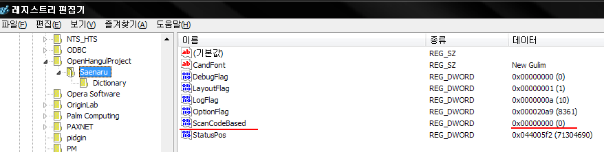

_Ergonomic layout은 적절한 선택일까?_

한글 자판을 세벌식 자판으로 바꾼 지 벌써 10년이 넘은 것 같습니다.
세벌식 최종을 썼다가 390으로 정착했는데, 세벌식을 쓰게된 계기가 동아리 선배 중에서 한분이 쓰는 걸 보고 좋다는 말에 혹해서 넘어간 것 같네요.

덕분에 제 자리 컴퓨터는 아무도 쓸 수 없었습니다.
이전 회사에서도 이슈 디버깅을 하려고 하면 제 컴퓨터를 안쓰고 따로 썼었죠.

한참 390 배열에 익숙해 진 후 영문 배열까지 바꾸려 했었던 기억이 납니다.
그때, 드보락(Dvorak) 배열로 시도했었는데, 가장 큰 문제가 Vim을 쓸 때 모든 단축키가 다 배열이 엉망이 되어버린다는 점이었습니다.
Vim은 방향키를 hjkl로 쓰는데, 드보락에서는 이게 두 손으로 분산되어있고 본디 모양이 아니라 정말 어색했습니다.
매핑 기능을 통해 이리저리 바꾸다보니 정말 너저분해져서 쓸 수 없는 상황이 오고나서야 드보락 자판을 버리게 되었네요.


이번에는 콜맥(Colemak)자판으로 변경해 볼까 합니다.
그때와 다르게 윈도우 자판에서는 날개셋 입력기가 두벌식과 세벌식을 공유하는 편한 방법, 복벌식을 제공하고있고, 한영 전환키를 여러개를 다른 동작으로 지정할 수 있어서 Shift + Space는 콜맥과 세벌식, 오른쪽 알트키는 쿼티와 두벌식에 할당하여 다른 사람도 편하게 쓸 수 있게 되었습니다.
다른 사람이 쓸때 글자가 이상하게 쓰여지면 바로 습관처럼 한영전환키를 누를 것이고, 그러면 곧장 쿼티나 두벌식으로 바뀌게 되어 불편함이 많이 줄어들었습니다.

## Colemak 자판의 좋은 점

새로운 자판을 익히는 것은 무척이나 고된 일인 것 같습니다.
아예 처음부터 배우는 것이 아니니, 기존의 익숙한 자판, 쿼티를 잊어야 하고, 새로운 자판에 익숙해져야 합니다.
무의식중에 손이 쿼티로 움직이니 오타가 미친듯이 납니다.
1분에 30단어를 입력하기 어려울 정도죠.

그럼에도 불구하고 Colemak으로 바꿀만한 이유가 있습니다.
콜맥은 손가락의 이동거리가 쿼티에 비해 반 이하로 짧습니다.
즉, 같은 글자를 입력하더라도 손의 피로도가 낮습니다.
또한 한 손으로 입력해야 되는 단어들 (예를 들면 rest, minimum)같은 경우 줄 사이를 건너뛰는 경우가 많이 줄어듭니다.

이로 인해 피로도도 줄어들지만, 또한 타이핑 속도도 빨라질 수 있습니다.
다만 전 타이핑 속도가 빠른 것은 개의치 않고, 손이 편하게 타이핑을 하고 싶어서 새로운 자판을 익히게 되었습니다.

## 윈도우에서 Colemak 자판 설정하기

윈도우에서는 [날개셋][ext:nalgaeset]이나 [새나루][ext:saenaru]를 설치해서 설정해야 합니다.
날개셋은 위에서 언급한 대로, 두벌식 + 쿼티 사용자와 컴퓨터를 공유할 수 있는 기능을 제공하지만 Ctrl 을 이용한 단축키는 쿼티 그대로 유지되서 저에겐 조금 혼동이 옵니다.
새나루는 단축키까지 다 콜맥 자판으로 변경되서 편리한데, 콜맥+세벌식390에서 세벌식 한글이 깔끔하게 입력되지 않는 문제가 가끔 발생합니다.
마치 콜맥 자판을 쿼티처럼 보고 그에 해당하는 세벌식 자소가 입력되는 것 처럼 보이는데, 예를 들면 'ㅅ' 글자는 세벌식390에서 'n'과 매핑되는데, 콜맥은 'n'이 쿼티의 'j' 키에 위치해 있으니 'j'를 눌러야 'ㅅ' 입력되는 경우입니다.

이게 발생하는 이유는 새나루 설치 후 기본 옵션이 스캔코드 방식이 아니라 입력되는 키를 후킹하는 방식이라서 그렇습니다.
새나루입력기를 설치 후 레지스트리에서 아래의 위치에 `ScanCodeBased`라는 이름의 `DWORD`키를 하나 추가해서 그 값을 1로 해보세요.[^scancode]

    HKCU\OpenHangulProject\Software\Saenaru

[^scancode]: <https://kldp.org/comment/521135#comment-521135> 의 새나루 개발자님 댓글 참조



맥에서는 기본 자판으로 지원하는 콜맥 자판과 390 자판이 서로 깔끔하게 작동해서 별 문제없이 사용하고 있습니다.
이런 부분은 좋네요...

[ext:nalgaeset]: http://moogi.new21.org/prg4.html
[ext:saenaru]: http://kldp.net/saenaru/

## Vim 세팅

영어 자판을 쿼티에서 벗어나는 순간, 단축키부터 다 바뀌게 되면서 혼란에 빠집니다.
처음 드보락을 시도했을 때에도 결국 좌절하고 쿼티로 돌아간 게 단축키 때문이었습니다.
윈도우 단축키는 별 문제가 아니였는데, 막상 가장 큰 문제가 되는 것이 Vim 단축키였습니다.

Vim은 일과 중 정말 자주 사용되는 도구이고, 지금 Atom을 쓰기 전까지는 제 글쓰는 도구이기도 했습니다.[^workflow]
그래서 떼놓을 수 없는 도구입니다.
작업환경인 Solaris 에서 Vim외에 다른 선택지가 있으면 좋겠지만, 쓸 수 있는 선택지가 emacs 밖에 없어서 눈물을 머금고 Vim을 다시 세팅해보기로 합니다.

[^workflow]: [Workflow][] 참조

Vim은 단축키가 그 동작을 나타내는 단어의 첫 글자로 이뤄져있는 특징이 있습니다.
예를 들면 'cw' 는 change word 의 첫 글자를 딴 단축키로, 현재 커서가 있는 단어를 바꿔치기 합니다.
'y' 도 yank로 복사하는 의미이고 'd'도 delete 의미로 지우는 뜻입니다.

그래서 기존 쿼티 위치대로 바꾸면 의미없이 단축키를 외위야 하게 되서 익히기가 더 어렵게 됩니다.
그나마 콜맥은 쿼티와 공유되는 위치가 많아서 'cw' 같은 경우는 같은 위치이지만, 문제는 방향키인 'hjkl' 입니다.
Esc 모드에서 커서처럼 동작하는 이 키는 콜맥에서는 영 엉뚱한, 그리고 조금 손가락이 닿기 어려운 불편한 곳에 있습니다.
그렇다고 이걸 리매핑하자니 키가 'hnei' 이라 'n' (next search), 'i' (insert) 이 정말 자주 쓰이는 세 키를 다른 곳에 할당해야 합니다.

저는 콜맥에서는 최대한 키 변경을 안하는 방향으로 하고 방향키는 Meta 키를 활용해서 움직이는 걸로 타협을 보았습니다.

````vi
" Mac hack so we can use Meta
let os=substitute(system('uname'), '\n', '', '')
if os == 'Darwin' || os == 'Mac'
    set macmeta
endif

" Colemak hjkl hack
nnoremap <M-h> <Left>|
nnoremap <M-n> <Down>|
nnoremap <M-e> <Up>|
nnoremap <M-i> <Right>|
````

그러나 조만간, 이런 꼼수가 필요없는 Emacs를 다시 한번 도전해 볼까 생각중입니다.