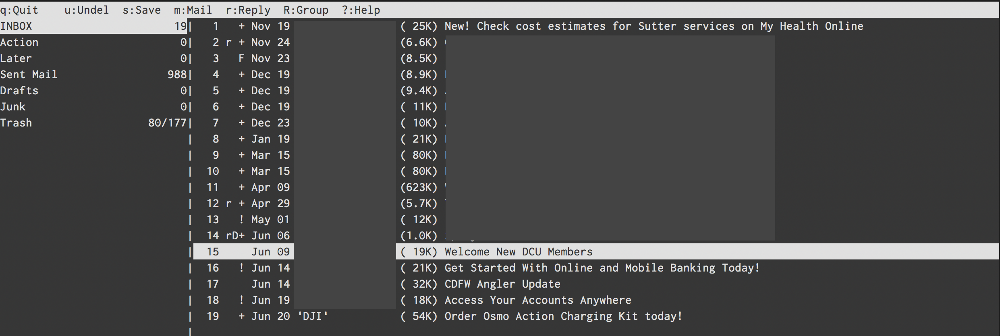

Gmail이 나온 지 이제 15년이 넘었습니다. 2004년 만우절에 1GB 라는 깜짝 놀랄만 한
용량을 들고 나오면서 이메일을 더이상 지울 필요 없다고 소개를 했었죠. 그때 당시
한메일 100MB였나요? 아니면 20MB였나요. 아무튼 그 작디 작은 용량의 메일함을
가지고 오래된 메일을 지워가며 옥신각신했던 기억이 납니다. 그 때에 그 작은 용량을
메꾸기 위해 메일은 오프라인으로 다운로드해두고 썼었죠.  다운로드는 POP을
이용해서 다운로드 했던 걸로 기억해요. 메일 클라이언트를 무엇을 썼는지는 기억이
나질 않는데 GUI가 덧입혀져있는 단순한 클라이언트로 기억을 합니다.

Gmail이 나오고 난 이후로 패러다임이 바뀌고 대부분의 메일 서비스가 1GB를 지원하기
시작하고, Gmail은 점점 메일함 용량을 키워가더니 이젠 15GB 용량을 통합해서 Gmail,
Google Drive, Google Photo (원본 사진)로 나눠 쓰게되었네요.

그때 당시 hanmail을 쓰다가 초대장을 받아서 gmail로 옮기고 지금까지 잘 써오고
있습니다. 메일 주소는 처음 쓰던 메일에서 조금 바뀌어서 이젠 개인 도메인 메일을
쓰지만 여전히 Gmail 서비스 위에서 (GSuite) 운영하고 있죠.

2013년 맥북프로를 구입하기 전 까지는 Gmail WebApp을 계속 써 오다 구입 후 Apple
Mail을 이용헤 이메일을 사용해 왔습니다. Apple Mail을 쓰면서 GnuPG signed email을
알게 되고 GPG Mail 플러그인을 이용해서 이메일을 서명해서 보내고 있습니다. 많은
사람들이 Apple Mail을 마음에 들어하지 않지만, 제가 써본 여러 메일앱 중에서
맥에서 쓸만한 앱은 Apple Mail 앱인 것 같네요. MailMate 외에는 거의 써본 것
같은데, 어떤 것은 이메일 credential을 자체 서버에 저장하는 앱도 있고 GnuPG
지원이 미흡한 앱도 있고, Gmail WebUI에 몇가지 기능을 추가만 한 앱도 있고, 결국은
다시 Apple Mail앱으로 돌아오더군요.

그러다 작년부터인가, GPG Mail 플러그인이 유료화 되었네요. 오랜기간 오픈소스로 잘
지원되어 왔으나 금액을 지불하지 않으면 GnuPG 기능을 Apple Mail app에서 못
사용하게 되어, 다른 방안을 물색했네요. GPG Mail이 오픈소스라 Paywall 부분만
삭제해서 내놓은 플러그인도 있었는데, 그걸 써오다 이번에 좀 색다른 시도를 하게
되었네요.

## Mutt

서론이 좀 길었는데, 결국 색다른 시도는 터미널에서 이메일을 사용하는 것입니다.
매일 대부분의 일과가 터미널에서 이뤄지는데, 이메일이라고 그러지 못할 이유가
없더군요. 이메일의 태생이 사실 터미널에서 이뤄진 것이기도 하구요. 일을 하다보면
이메일을 자동화 해서 보낼 때가 있는데 그것 또한 sendmail을 이용해서 보내곤
했으니, 그다지 어렵지는 않을 것 같았습니다.

그런데, 이메일 세팅으로 이주일 가까이를 쓰게될 줄은 몰랐네요. -_-

먼저 가장 메인이 되는 프로그램은 Mutt라는 터미널에서 동작하는 메일 관리
앱입니다.



공돌이들만 쓸 것 같은 디자인 (터미널 앱에서 디자인을 따지는 게 우습긴 하지만)에
기능은 엄청 많아서 파고들면 한도 끝도 없을 것 같은 모습의 이메일 앱 Mutt입니다.
처음엔 [mutt][]를 설치해서 사용하다 [Notmuch][notmuch] 인덱싱 앱을 같이 쓰면서
좀 더 기능이 추가된, 안그래도 많은 기능에 더 추가된, [neomutt][]을 설치해서
사용하고 있습니다.

사실 mutt만으로도 터미널에서 이메일을 사용하는데에 문제는 없습니다. 오래 전 메일
관리 방식인 Maildir부터해서 IMAP도 지원하고, IMAP 중 인증 방식을 Gmail 최신 인증
방식인 OAUTH까지 지원해서 구지 아래에서 언급 할 다른 앱을 연동해서 사용할 필요가
없어요.

다만, 이 후에 이야기할 것은 모두, 인터넷이 연결되지 않았을 때에도 이메일을
작성하거나, 이메일을 검색할 수 있도록 하고, mutt가 직접 인터넷 연결을 하지 않고
백그라운드에서 알아서 메일을 동기화 시킬 수 있게 하는 방법에 관한 것입니다.
mutt에서 직접 IMAP 폴더에 접속하면 반응성이 조금은 떨어지더라구요. 약간씩 반박자
느린 것 같은 느낌에 다른 방법을 조금씩 찾아보다보니 많이 곁다리로 흐르게
되었네요.

### OAUTHBEARER 인증

일단, Gmail을 쓰게되면 mutt 환경 설정시 가장 처음 겪게 되는 어려움이 있다면 바로
IMAP, SMTP 인증일 것 같네요. 사실 이게 거의 시작이자 끝입니다. Gmail이 보안성을
향상하고자 IMAP, SMTP는 SSL 보안 채널로만 통신하게 했는데, 거기에 더해서
비밀번호조차 사용할 수 없게 바꿔놓았습니다. 예전엔 계정을 보안에 취약한 계정으로
옵션을 바꾸면 로그인 비밀번호를 이용해 IMAP, SMTP를 쓸수 있었다고 하는데, 이젠
그것도 안되고 [AppPassword][]나 아니면 OAuth2를 이용해서만 로그인 할 수 있는
걸로 압니다.

AppPassword는 이미 Apple Mail에서 써왔는데, 곧 사라질지도 모른다는 소문이
있어서 OAuth2를 이용해서 로그인 하는 방법을 썼네요.

먼저 구글 개발자 콘솔에서 Credential 토큰을 만들어야 합니다. 아마 터미널에서
이메일을 사용하고자 하는 사람이라면 어느정도는 이해하실거라 봅니다. 이해가
안되면 사실 터미널에서 이메일 쓰는 걸 권장하지 않아요. 정말 이건 Nerd만을 위한
세팅이니까요...

[Google Developer Console][google-api] 에 들어가셔서 프로젝트가 없다면 만드신 후
Credential에서 Oauth 2.0 Client ID를 하나 만듭니다. 여기서 나오는 Client ID와
Client Secret는 잘 보관해 둡시다.

Google에서 제공하는 [oauth2.py][] 파일을 받아서 실행파일 옵션을 줍시다. 이
파일이 일정시간마다 새로운 접속 토큰을 구글 서버에서 받아오는 일을 합니다. help
option을 보면 어떻게 사용하는 지 나오는데, 일단 Auth token을 생성합니다.

```console
$ oauth2.py --generate_oauth2_token --client_id={ID} --client_secret={SECRET}
```

커맨드를 실행하면 웹브라우저가 열리면서 verification code를 생성하고 refresh
token과 access token을 만듭니다. 여기서 refresh token을 잘 보관합니다. 이 토큰은
다음에도 다시 access token을 만들어내는데 쓰입니다. 그러면 `.muttrc`에서
`$imap_oauth_refresh_command`, `$smtp_oauth_refresh_command`에 아래 항목을
추가하면 mutt가 IMAP에 접근할 때나 메일을 보내려할 때 `oauth2.py`를 실행해서
토큰을 만들어냅니다.

```console
"oauth2.py --quiet --client_id={ID} \
  --client_secret={SECRET} \
  --refresh_token={TOKEN}"
```

## MSMTP

여기서 좀 더 발전해서 메일을 관리하는 mutt와 메일을 주고 받는 SMTP, IMAP을
분리하려고 했습니다. 먼저 SMTP를 보면, 대세는 MSMTP더군요. MSMTP는 인증을 LOGIN
인증 (ID, Password)만 지원했으나 1.8.4 버전에서 OAUTH를 지원하기 시작했습니다.
뭐 그래봤자 그냥 로그인 할 때 AUTH OAUTHBEARER {PASSWORD}를 보내는 것 밖에
없더군요. 그래서 저 Password 부분에 무었을 넣어야 할 지 정말 헤맸습니다.

결국 OAUTHBEARER spec을 찾아본 뒤에야 아래의 포맷으로 보내야 되는 걸 알게
되었네요.

```
n,a=user@gmail.com,\001host=smtp.gmail.com\001port=465\001auth=bearer\001
{access_token}\001\001
```

위의 access_token은 refresh token을 이용해서 만들어지는 토큰으로 oauth2.py를
사용하면 얻어낼 수 있으나, oauthbearer 인증 문자열은 oauth2.py에서는 만들어내질
않더군요. 조금 더 오래 된 XOAUTH2 방식만 만들어냅니다. 그래서 일단 oauth2.py를
이용해 access_token을 얻어낸 후 위의 문자열에 치환해서 base64 encoding을 하게
하는 쉘 스크립트를 만들어 msmtp의 passwordeval 값에 넣게 했습니다.

한 문단에 끝날 내용을 알아내기위해 거의 하루를 허비했죠. :)

덤으로, 보안을 좀 더 높이기 위해 client_id, client_secret, refresh_token을 gpg
encrypt 해서 파일로 보관했습니다. 그래서 shell script에서 `gpg -d` 명령을 이용해
파일에서부터 decrypt합니다. 덕분에 주기적으로 gpg 암호를 입력해야 하긴 하지만
보안이 조금은 올라가게 되어 불편함은 감수할 만 했네요.

## IMAP

사실 이 부분에서 가장 시간을 많이 허비했네요. 너무 많은 IMAP 클라이언트 앱이
있어서 그 중에 어떤 것을 써야 할 지 테스트 해보고 적용하느라 많이 시간을
썼습니다.

가장 처음 시도했던 것은 [OfflineIMAP][]입니다. 가장 널리 알려져 있는
프로그램이기도 하고 세팅하는 데 가장 시간이 덜 걸렸던 앱이기도 합니다. oauth2가
이미 잘 지원되어 id, secret, refresh token만 넣어주면 알아서 억세스 토큰을
만들어 gmail에 접속합니다.

다만 사용하면서 좀 문제가 된 부분은, Gmail의 Label을 잘 지원하지 못한다는
점입니다. 태생이 Maildir은 파일 단위로 이메일을 관리하는 방식이고 Gmail은
Tagging 방식이라 서로 잘 섞이지 못하는게 어찌 보면 당연해 보이긴 하지만,
오프라인으로 이메일을 관리하다가 gmail web 에 접속하면 읽었던 메일이 여전히
인박스에 있고 (읽으면 archive를 보통합니다) 지운 메일이 잘 안지워지는 등 웹앱과
혼용하기가 조금 어렵더군요. 스마트폰으로 이메일을 보는 경우도 잦아서 두개가
싱크가 잘 맞았으면 했지만 그건 좀 어려워 보였습니다.

게다가 IMAP 싱크하는 데에 시간이 꽤 많이 걸리는 부분도 문제였죠. Label별로
폴더가 만들어지고 서로 중복되기도 해서 메일이 새로 왔는지 확인하는 시간이 꽤
걸립니다. 어찌 저찌 세팅은 다 맞춰서 동작하는 데에 무리가 없었지만, CPU도
잡아먹고 시간도 걸리고 해서 다른 방법이 있을까? 하고 좀 더 검색해 보았네요.

다음 후보는 [mbsync (isync)][mbsync] 였는데, 이 앱은 하루를 허비하고는
포기했네요.  Oauth2를 이용해서 접속하는 게 매우 까다로웠습니다. app password를
쓰는 게 가장 속편한데 app password는 쓰지 않기로 해서 건너뛰었네요. 대신 싱크
속도는 OfflineIMAP보다 매우 빨랐습니다.

그리고 마지막으로 시도한 프로그램이 [gmailieer][lieer]입니다. 이젠 이름이
lieer로 바뀌었더군요. 이 앱은 Gmail 전용 프로그램입니다. Google Gmail API를
이용해서 이메일을 받아와서 무척 속도도 빠르지만 Gmail에만 종속되어있죠. 뭐 제
이메일이 gmail만 사용하고 있어서 이 부분은 문제가 되지 않았네요.

개발자 콘솔에서 Gmail API를 활성화 시켜주고 나면 같은 Oauth를 이용해 접근할 수
있습니다. gmailieer에서 알아서 refresh_token까지 생생하는 것을 도와주니 이전에
썼던 토큰을 써도 되고 따로 써도 되더군요.

## Notmuch

gauteh/lieer 프로그램을 쓰기 위해선 반드시 하나의 프로그램이 더 필요한데 [notmuch][]
라는 프로그램입니다. Notmuch는 이메일을 인덱싱하고 tag를 관리해 주는
프로그램인데, gauteh/lieer 프로그램이 Gmail API를 이용해 메일을 긁어와서 이
notmuch 용 태그로 변환을 시켜줍니다. 태그라서 이메일 중복 걱정도 없더군요.
그러나 기존 세팅과는 다르게 mutt에서 virtual spool file을 써야합니다. 게다가
폴더 개념도 없어져서, 기존에 만들어 두었던 모든 단축키가 무용지물이 되더군요. 그
모든 것을 다 수정하고 설청하고 나니 gauteh/lieer와 찰떡궁합의 세팅이 되었네요.

결국 neomutt + notmuch + lieer + msmtp 조합으로 완성되었습니다. notmuch는
lieer와 neomutt을 이어주는 역할을 하고 msmtp는 순전히 메일을 보내는 용도로만
사용합니다. 

### afew

notmuch를 쓰게되면, Gmail에서 라벨을 관리하는 것과 비슷한 방식으로 콘솔에서
메일을 관리할 수 있게 됩니다. 이 라벨을 메일을 받아올 때 처리할 수 있는 방법이
있습니다. `$NOTMUCHDATADIR/.notmuch/hooks/post-new` 스크립트에 필요한 명령어를
입력하면 되는데요. 예를 들면 아래와 같은 커맨드를 넣어두면 특정 주소에서 보낸
메일을 따로 라벨을 추가할 수 있습니다.

```bash
#!/usr/bin/env bash
# post-new
notmuch tag:+boss -- from:myboss@example.com
```

이게 한 두개면 되는데, 점점 많아지면 관리가 점점 힘들어지더군요. 그래서 다른
프로그램이 없나 봤더니 [afew][]가 notmuch 의 `new` 태그를 가지고 필터링을 할 수
있게 해주는 프로그램이더군요. 이것으로 많은 필터링을 자동화 하고 있습니다.

## GnuPG

가장 중요하게 생각했던, 그러나 encryption기능은 일년에 한번 쓸까 말까한 GnuPG는
이미 mutt에서부터 지원합니다. PGP sign key ID만 지정해 두면 메일을 보낼 때 `p -> s`
키를 이용해 메일을 서명해서 보낼 수 있습니다. Apple Mail에서는 설정이 무척
까다로웠는데 한방에 끝나서 허탈하기까지 합니다.

`gpg.rc`를 https://gitlab.com/muttmua/mutt/blob/stable/contrib/gpg.rc 에서 다운
받은 후 `~/.mutt/` 폴더에 넣은 후 `.muttrc`에서 `source ~/.mutt/gpg.rc` 후
`pgp_default_key`와 `pgp_sign_as` 를 각각 기본 Key ID와 Sign Key ID로 지정해주면
세팅이 끝납니다.

## Multi Account

(추가: 2019-11-15) 이메일 계정이 두개가 되면서 배운 사실을 기록해 볼까 합니다.
이메일 계정이 두개가 되면 메일을 받아오는 [lieer][]는 각각의 계정마다 따로
실행되어야 합니다. 그런데 notmuch는 필터링 규칙도 있다보니 한방에 실행되는게
좋구요. neomutt도 한 곳에서만 쓰니 아무래도 notmuch는 한곳에 있는게 낫더군요.

그래서 고심하면서 구글링을 하다보니, 아래와 같은 디렉토리 구조가 나오게 되었습니다.

```console
~/Maildir/
  .notmuch/             # Notmuch
    hooks/post-new      # afew 프로그램 실행 스크립트
  work/                 # Work email 계정
    .gmaileer.conf      # lieer config
  home/                 # Personal email 계정
    .gmaileer.conf      # lieer config
```

`~/.notmuch-config` 에서 디렉토리를 `~/Maildir`로 정해주어야 하고, 이메일도 두
계정의 이메일을 모두 추가합니다. [neomutt][] 또한 mailbox 디렉토리를 `~/Maildir`
로 지정해서 두 계정의 이메일을 한번에 불러올 수 있도록 설정해야 클라이언트
하나에서 볼 수 있습니다.

`work/`, `home/` 을 섞어쓰면 문제점이 메일을 작성할 때
`from` 부분이 항상 `primary` 이메일 주소로 지정이 되더군요. 이 부분을 항상
유심히 보고 고쳐주어야 합니다. 아니면 아예 neomutt에서 각 계정에 해당하는 메일
작성 단축키를 따로 지정하는 것도 유용합니다.

답변을 할 때에는, neomutt 설정 파일에 `alternates` 에 이메일을 추가로 기입해
주고 `set envelope_from=yes` 와 `set reverse_name=yes`를 추가하면, 받은 사람
주소를 from으로 사용합니다. 즉 work@example.com으로 이메일이 오면 그 이메일이 `alternates`에 있을 경우 해당 이메일을 `from` 으로 설정해서 답변메일을 작성합니다.

## Conclusion

장황하게 복잡한 내용을 이해를 바라지않고 써내려가긴 했지만, 몇몇 분에게는 유용한
팁이 되길 바라는 마음에 글을 써봅니다. 저 조차도 이 세팅을 해 가면서 OAuth2에
대한 자료가 너무 없어서 힘들었었는데, 누군가는 이 글을 보고 일주일동한
파고들었어야 할 일을 10분안에 끝낼 수 있었으면 좋겠네요.

[mutt]: http://www.mutt.org
[neomutt]: https://neomutt.org
[notmuch]: https://notmuchmail.org
[AppPassword]: https://support.google.com/accounts/answer/185833?hl=en
[google-api]: https://console.developers.google.com/apis/credentials
[oauth2.py]: https://github.com/google/gmail-oauth2-tools/blob/master/python/oauth2.py
[OfflineIMAP]: http://www.offlineimap.org
[mbsync]: http://isync.sourceforge.net
[lieer]: https://github.com/gauteh/lieer
[afew]: https://github.com/afewmail/afew